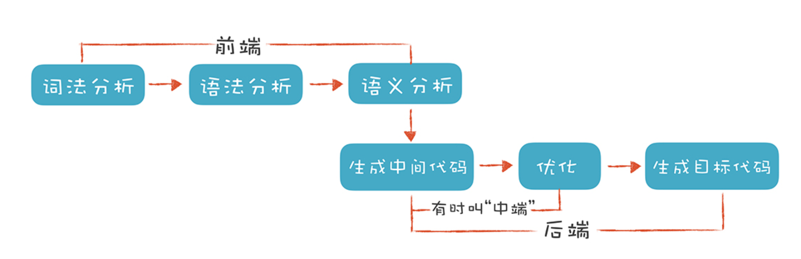

# 编译器

编译器往往分为这几个部分。

如下图所示:



编译器往往分为两大部分，前端和后端，而前端分为词法分析，语法分析，语义分析。后端分为代码生成，优化以及生成目标代码。

这样是非常抽象的。下面举个具体例子。

假设有如下代码，其作用是求两数的平均值。怎么翻译该语句为可运行的指令？

```js
var average = (min + max) / 2;
```

## 词法分析(Scanning)

Scanning作用是把源代码变成特定符号(tokens)。Scanner会扫描代码，忽略掉那些没用的注释、空白字符、，留下一组有意义的tokens序列。

比如上面的语句就会被分为如下tokens


## 语法分析(Parsing)

得到tokens后就是语法分析。在代码运行时，不同的符号处理的优先级会有所不同，需要一种树状结构来描述这个关系，而语法解析器(parser)就会把tokens转化为一个树状结构，一般被称作抽象语法树(abstract syntax tree，一般取缩写称为AST)。

## 语义分析(Analysis)

光有语法分析还不够，因为执行代码时不光要知道当前表达式的含义，还需要知道上下文，比如上面的示例执行到`min + max`时，需要先知道min和max的值。有时候某个符号还可能表示其包含的语句是一段代码，比如函数和类等等。

前面三个部分为前端。

## 中间表示(Intermediate representations)

中间表示(IR)不是必须的。但是大部分编译器都会需要有这个模块。这个模块作用是实现前后端分离。假设有一个编译器让C语言能够运行在arm，X86，mips等多种平台上，如果缺少IR层则需要实现`C->ARM, C->X86, C->mips`。如果有IR层则只需要实现`C->IR`，然后`IR->ARM, IR->X86, IR->mips`。这样可以减少很多工作，而且扩展性更好。

## 优化(Optimization)

优化也不是编译器必须的模块。但是对于任何一个成功的编译器来说它往往是最重要也是最耗时的工作。一个优化的例子，常量折叠。

比如如下的例子：

```js
area = 3.14159 * (0.75 / 2) * (0.75 / 2);
```

编译器在编译的时候可以将其替换为：

```js
area = 0.4417860938;
```

这样运行代码时便不需要计算了。

## 代码生成(Code Generation)

代码生成即为把IR变成真正的可执行文件的过程。一般生成的是机器码(machine code)或者字节码(bytecode)。

机器码可以直接被操作系统加载到cpu内存里执行，其本身为机器指令运行速度很快。但是现在cpu架构有成堆的指令以及沉重的历史包袱，并且如果直接生成机器码那意味着不同的cpu架构需要生成不同的机器码，缺乏可移植性。

所以诞生了字节码。字节码不是真正的CPU能够执行的机器码。而是一种虚拟的，理想的指令。通常每条指令为一个字节。

这样设计可以增加一个虚拟机层专注处理机器码和指令集之间的映射关系，而语言本身的设计可以不用考了成堆的历史包袱。

## 虚拟机(Virtual Machine)

现代语言有不少存在虚拟机层(比如java)。字节码是不能直接运行的，它需要实现一个编虚拟机，虚拟机模拟芯片在字节码运行时支持该虚拟的架构。因为每次执行都必须在运行时模拟每条指令，所以往往比直接生成机器码的语言要慢。

但是获得了**可移植性**和**简单性**。