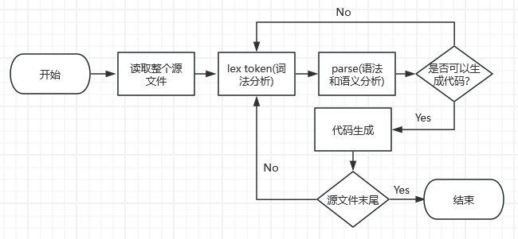
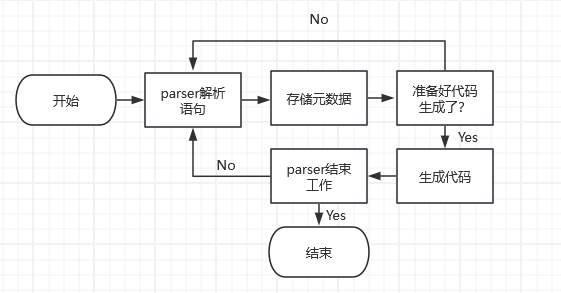

# 代码生成器

之前实现的实际上是PL/0代码验证器，因为只将词法分析器和解析器组合成编译器的完整前端。它实际上不是一个完整的PL/0编译器，因为一个完整的编译器会做所有验证器能做的事情，并且输出一个新的代码表示(中间代码)。

由于自己实现编译器后端太过复杂，并且该编译器实现是C语言。PL/0编译器的代码生成为C会让很多事情变得容易，当然这样做会缺少不少乐趣(比如IR到x86指令的转换等工作)。

本文将讲解为语法中的所有PL/0代码生成正确的(不那么好看)C代码。

## 代码组织

回顾一下架构图:



在编译器源代码本身中，我将把代码生成器放在词法分析器和解析器之间。

我将用`cg_`作为解析器使用的所有代码生成器函数的前缀，这样就可以通过函数前缀明确哪些函数与解析工作相关而哪些与解析工作无关来更容易地阅读解析器代码。

## 生成代码输出函数

所有代码生成器函数将至少调用一次名为`cg_out()`的函数。这个函数是唯一完成向`stdout`写入工作的函数。实现如下:

```c
void cg_out(const char *fmt, ...)
{
    va_list ap;

    va_start(ap, fmt);
    (void) vfprintf(stdout, fmt, ap);
    va_end(ap);
}
```

该函数其实是`(void) fprintf(stdout， "%s"，…);`的封装。主要作用是将参数格式化后输出到stdout。

## cg_end

第一个代码生成函数我将实现`cg_end()`。当我们知道解析完成并成功时，就会调用它，这意味着我们有一个有效的PL/0程序。它只是打印一条注释:

```c
void cg_end()
{
    cg_out("/* PL/0 compiler %s */\n", PL0C_VERSION);
}
```

它可以很容易地看出编译是否成功，因为要么看到这个注释，要么看不到。同时在源代码的顶部添加了一个`#define PL0C_VERSION"0.0.1"`。在以后进一步开发编译器时，可以将这个数字增加。`cg_end()`函数在解析器的最后被调用:

```c
void parse()
{
    next();
    block();
    expect(TOK_DOT);

    if (type != 0)
        error("extra tokens at end of file");
    cg_end();
}
```

## 代码生成器工作流详解

回到最上面的编译器架构图，可以知道代码生成和解析器(parser)是紧密结合的。


代码生成模块需要跟踪解析器(parser)。假设编译器得到了一个PL/0程序，它在解析器中使用了所有可能的分支和语句。当跟随解析器在这个假想的程序中工作时，编写代码生成器的工作流大致如下:



上图遗漏了一些细微差别，在解析过程中的某些地方，将丢弃一些元数据。但是上图的工作流程就阐述了需要做的大多数编码的逻辑。

## 为常量生成代码

代码生成要嵌入解析器流程中的第一个函数为`block()`。在`block()`中，首先要处理的是常量。因为根据PL/0语法。要做的第一件事是检查是否有`TOK_CONST`，如果有，就进入常量声明部分。假设这发生了。然后运行`expect(TOK_CONST);`使用`TOK_CONST`，并让词法分析器获取并返回下一个token。下一个token应该是一个`TOK_IDENT`，为常量的名称。

在这里，就有足够的信息来输出一些代码。但是能不能不调用`expect(TOK_IDENT);`就输出代码呢？如果可以就会跳过`TOK_IDENT`这个token而去到下一个了。但是如果PL/0源文件是错误的有常量而没有常量名即之后没有`TOK_IDENT`，此时也应该输出任何代码。因此，要遵循的一般模式是，在`expect(TOK_IDENT)`之前，将执行代码生成器检查，以确保具有正确的token类型，如果下一个token也正确才调用代码生成器来生成所需的代码。

如果下一个token不是`TOK_IDENT`，这个“代码生成器检查”将失败。

当然这个实现非常低效，相当于遇到了const token然后检查下一个token是否为ident。是则生成，其实应该顺序执行const生成其对应的代码，ident生成其对应的(不管最后对错)。这里相当于多做一次检查。

实现如下:

```c
if (type == TOK_CONST) {
    expect(TOK_CONST);
    if (type == TOK_IDENT)
        cg_const();
    expect(TOK_IDENT);
    expect(TOK_EQUAL);
    expect(TOK_NUMBER);
    while (type == TOK_COMMA) {
        expect(TOK_COMMA);
        if (type == TOK_IDENT)
            cg_const();
        expect(TOK_IDENT);
        expect(TOK_EQUAL);
        expect(TOK_NUMBER);
    }
    expect(TOK_SEMICOLON);
}
```

需要将`cg_const()`调用放在两个位置，因为可以有多个常量。

实现生成c的常量声明代码:

```c
void cg_const()
{
    cg_out("const long %s=", token);
}
```

接下来完成常量生成的所有工作。同样的想法:一旦使用了等号`=`，就有了完成这行C代码所需的所有信息。如果它是有效的PL/0代码，有一个数字那么必定会存在一个等会。将做同样的事情，在`except(TOK_NUMBER);`之前，我们将对`TOK_NUMBER`进行“代码生成器检查”，如果为真，则输出数字。

实现代码如下:

```c
if (type == TOK_CONST) {
    expect(TOK_CONST);
    if (type == TOK_IDENT)
        cg_const();
    expect(TOK_IDENT);
    expect(TOK_EQUAL);
    if (type == TOK_NUMBER) {
        cg_symbol();
        cg_semicolon();
    }
    expect(TOK_NUMBER);
    while (type == TOK_COMMA) {
        expect(TOK_COMMA);
        if (type == TOK_IDENT)
            cg_const();
        expect(TOK_IDENT);
        expect(TOK_EQUAL);
        if (type == TOK_NUMBER) {
            cg_symbol();
            cg_semicolon();
        }
        expect(TOK_NUMBER);
    }
    expect(TOK_SEMICOLON);
}
```

使用了两个代码生成函数来完成C代码的生成:`cg_symbol()`和`cg_semicolon()`。在需要分号的地方使用`cg_semicolon()`语句。为了防止很长的行，生成一些类似于正常的C代码输出，它打印一个分号，后跟一个换行符:

```c
void cg_semicolon()
{
    cg_out(";\n");
}
```

`cg_symbol()`是一个用于捕获所有符号并生成对应c代码的函数。对于`TOK_IDENT`和`TOK_NUMBER`，生成token对应的字符串。对于其他内容，生成相应符号:

```c
void cg_symbol()
{
    switch (type) {
    case TOK_IDENT:
    case TOK_NUMBER:
        cg_out("%s", token);
        break;
    case TOK_BEGIN:
        cg_out("{\n");
        break;
    case TOK_END:
        cg_out(";\n}\n");
        break;
    case TOK_IF:
        cg_out("if(");
        break;
    case TOK_THEN:
    case TOK_DO:
        cg_out(")");
        break;
    case TOK_ODD:
        cg_out("(");
        break;
    case TOK_WHILE:
        cg_out("while(");
        break;
    case TOK_EQUAL:
        cg_out("==");
        break;
    case TOK_COMMA:
        cg_out(",");
        break;
    case TOK_ASSIGN:
        cg_out("=");
        break;
    case TOK_HASH:
        cg_out("!=");
        break;
    case TOK_LESSTHAN:
        cg_out("<");
        break;
    case TOK_GREATERTHAN:
        cg_out(">");
        break;
    case TOK_PLUS:
        cg_out("+");
        break;
    case TOK_MINUS:
        cg_out("-");
        break;
    case TOK_MULTIPLY:
        cg_out("*");
        break;
    case TOK_DIVIDE:
        cg_out("/");
        break;
    case TOK_LPAREN:
        cg_out("(");
        break;
    case TOK_RPAREN:
        cg_out(")");
    }
}
```

在这个列表中有一些看起来很奇怪的逻辑，例如`TOK_ODD`，会在之后遇到它们时讨论它们。

输出当前的符号后，此时已经知道它是一个数字。然后只需要输出一个分号来结束C语句。

现在已经为所有`const`常量模块生成了正确的C代码。

## 符号表实现

当为const节生成正确的C代码时，忽略了编译器所做的一个非常重要的方面:它必须强制对它所读取的源代码进行一些语义理解。可以这样考虑这两个问题:语法只检查标记是否以满足语法的形式排列;语义检查这些标记在这种安排中的含义是否可以理解。

以英文来做下说明:

- "The professor a lecture."英语的句法规则要求在这个句子里有一个动词，但是没有。解析这个句子会引发语法错误。
- "The pinball machine watered a lecture."这个句子符合英语语法规则，但没有意义。语义检查应该将其标记为不可理解。

要解决的第一个语义理解是知道哪些符号被声明了，从而可以被引用，确保在相同的作用域(这里的实现可称之为深度级别)中没有具有相同名称的符号，并在读取新的常量和变量声明以及进入和退出过程时对这种理解进行调整。

如果最简单的实现，可以把所有这些限制都留给C编译器。但这是一种非常糟糕的风格，因为当需要编写程序后端时这种前端加中端将无法工作。因此应该编写一个只输出正确C代码的编译器。因此，需要一个符号表。

符号表将需要跟踪以下信息:符号的名称，如果符号是`TOK_CONST`, `TOK_VAR`或`TOK_PROCEDURE`类型的token，还需要标明符号的深度级别(作用域)。它需要在遇到常量和变量时添加它们。同时它还需要在遇到`procedure`时添加该`procedure`的局部常量和变量。而当解析器退出`procedure`时(解析完成`procedure`后)，符号表需要销毁每个`procedure`中的所有局部常量和变量。这是因为应该能够在不同的`procedure`中重用相同的局部变量名。

尽量把事情简单化。下面是符号表变化图，先声明了全局常量和变量，然后声明了`Procedure`,最后解析完`Procedure`代码块后符号表如下:

```
+---------------+ +---------------+ +---------------+ +---------------+
| Sentinel      | | Sentinel      | | Sentinel      | | Sentinel      |
+---------------+ +---------------+ +---------------+ +---------------+
                  | Global consts | | Global consts | | Global consts |
                  +---------------+ +---------------+ +---------------+
                  | Global vars   | | Global vars   | | Global vars   |
                  +---------------+ +---------------+ +---------------+
                                    | Procedure     | | Procedure     |
                                    +---------------+ +---------------+
                                    | Local consts  |
                                    +---------------+
                                    | Local vars    |
                                    +---------------+
```

下面是符号表基本数据结构的声明:

```c
struct symtab {
    int depth;
    int type;
    char *name;
    struct symtab *next;
};
struct symtab *head; 
```

使用单链表来组织符号表。

将在进入解析器之前用初始化符号表头`head`，它将始终是链表中的第一个节点。通过head可以遍历整个符号表对所有符号进行操作，同时它还可以防止在添加符号时出现“符号表是否为空”的问题。保证符号表这个数据结构中总是至少有一个符号。

```c
void initsymtab()
{
    struct symtab *new;

    if ((new = malloc(sizeof(struct symtab))) == NULL)
        error("malloc failed");

    new->depth = 0;
    new->type = TOK_PROCEDURE;
    new->name = "main";
    new->next = NULL;

    head = new;
}
```

现在准备添加一个函数，将编译器找到的符号添加到符号表中:

```c
void addsymbol(int type)
{
    struct symtab *curr, *new;

    curr = head;
    while (1) {
        if (!strcmp(curr->name, token)) {
            if (curr->depth == (depth - 1))
                error("duplicate symbol: %s", token);
        }

        if (curr->next == NULL)
            break;

        curr = curr->next;
    }

    if ((new = malloc(sizeof(struct symtab))) == NULL)
        error("malloc failed");

    new->depth = depth - 1;
    new->type = type;
    if ((new->name = strdup(token)) == NULL)
        error("malloc failed");
    new->next = NULL;

    curr->next = new;
}
```

每次遍历整个链表。如果有一个符号名称匹配，检查深度是否一致(一致说明出问题了!)以确保深度级别不相同。如果是，那就是重复符号错误。你会注意到总是用`depth - 1;`这是因为在`block()`中，在检查之后立即增加深度级别，以确保没有嵌套过程，因此深度变量总是比当前所在的高一级。

一旦在符号表的最后一个表项，检查到其没有重复，此时再创建一个新的符号。记录`token`字符串，这个标识符之前是否有`TOK_CONST`、`TOK_VAR`或`TOK_PROCEDURE`，有则需要记录深度级别。因为此时已经在符号表的末尾了，所以这个符号没有next。然后将这个新符号附加到当前最后一个符号的下一个符号。

最后，需要一个函数来销毁符号。由于不能摧毁所有的符号。只需要销毁解析器刚刚留下的`Procedure`的局部`TOK_CONST`和`TOK_VAR`符号(即局部变量和局部常量)。同时需要保留所有`TOK_PROCEDURE`符号。在编译结束时，符号表应该是一个链表，从`head`开始，然后是全局常量和变量，然后列出源代码文件中的所有`TOK_PROCEDURE`名称。

由于`TOK_PROCEDURE`符号总是第一个记录的符号，它的局部`TOK_CONST`和`TOK_VAR`符号在后面，因此可以跳到链表的末尾，检查这个符号是否为`TOK_PROCEDURE`。如果不是，应该销毁它，因为它是一个局部`TOK_CONST`或`TOK_VAR`。应该一直销毁符号，直到在列表的末尾找到`TOK_PROCEDURE`:

```c
void destroysymbols(void)
{
    struct symtab *curr, *prev;

again:
    curr = head;
    while (curr->next != NULL) {
        prev = curr;
        curr = curr->next;
    }

    if (curr->type != TOK_PROCEDURE) {
        free(curr->name);
        free(curr);
        prev->next = NULL;
        goto again;
    }
}
```

此时会注意到，从来没有清理过链表。编译器是一个寿命很短的程序，典型的策略是在编译器退出时让操作系统在之后进行清理。因此编译器不太在乎内存的清理。

## 真正完成常量部分

现在可以将`addsymbol()`添加到解析器中，真正地完成常量部分。最后，这是我们完成的常量段代码:

```c
if (type == TOK_CONST) {
    expect(TOK_CONST);
    if (type == TOK_IDENT) {
        addsymbol(TOK_CONST);
        cg_const();
    }
    expect(TOK_IDENT);
    expect(TOK_EQUAL);
    if (type == TOK_NUMBER) {
        cg_symbol();
        cg_semicolon();
    }
    expect(TOK_NUMBER);
    while (type == TOK_COMMA) {
        expect(TOK_COMMA);
        if (type == TOK_IDENT) {
            addsymbol(TOK_CONST);
            cg_const();
        }
        expect(TOK_IDENT);
        expect(TOK_EQUAL);
        if (type == TOK_NUMBER) {
            cg_symbol();
            cg_semicolon();
        }
        expect(TOK_NUMBER);
    }
    expect(TOK_SEMICOLON);
}
```

剩下的工作就是一个个解析PL/0的各个部分了。

## 变量部分的代码生成实现

可以使用刚刚写好的所有内容来编写变量段的代码生成实现:

```c
if (type == TOK_VAR) {
    expect(TOK_VAR);
    if (type == TOK_IDENT) {
        addsymbol(TOK_VAR);
        cg_var();
    }
    expect(TOK_IDENT);
    while (type == TOK_COMMA) {
        expect(TOK_COMMA);
        if (type == TOK_IDENT) {
            addsymbol(TOK_VAR);
            cg_var();
        }
        expect(TOK_IDENT);
    }
    expect(TOK_SEMICOLON);
    cg_crlf();
}
```

这里用到了一个新的代码生成函数，只是为了样式:`cg_crlf()`，它在输出的C代码中添加了一个换行符:

实现如下:

```c
void cg_crlf()
{

    cg_out("\n");
}
```

它只在这一个地方使用。当然为了代码更好看其可以在多个地方使用包括在`cg_out()`函数中调用。

下面是`cg_var()`的代码，它与`cg_const()`函数非常接近(少了`const`):

```c
void cg_var()
{
    cg_out("long %s;\n", token);
}
```

与必须初始化的常量不同，变量可以不初始化。所以可以在这里写出一个完整的C语句。现在已经完成了代码生成的所有常数和变量部分。

## procedure的代码生成

`procedure`的生成相比其他部分是非常困难的。从C的角度来看，有这种奇怪的情况，在PL/0中，所有的`procedure`都存在于main()函数(PL/0的main可以当作主`procedure`)中，这在C中是不存在的。此外，主`procedure`本身没有名称。需要某种方法来跟踪是在命名`procedure`还是在未命名的主`procedure`中。所以将创建一个名为`proc`的新全局变量来跟踪该信息。

除此之外，这个例程与对常量和变量所做的几乎相同:

```c
while (type == TOK_PROCEDURE) {
    proc = 1;

    expect(TOK_PROCEDURE);
    if (type == TOK_IDENT) {
        addsymbol(TOK_PROCEDURE);
        cg_procedure();
    }
    expect(TOK_IDENT);
    expect(TOK_SEMICOLON);

    block();

    expect(TOK_SEMICOLON);

    proc = 0;

    destroysymbols();
}

if (proc == 0)
    cg_procedure();
```

在每个`procedure`结束时，需要销毁该`procedure`的所有`TOK_CONST`和`TOK_VAR`标识的局部变量和局部常量符号。还需要将全局`proc`变量重置回0，因为在某些时候我们将进入`main()`块并需要处理它。

```c
void cg_procedure()
{

    if (proc == 0) {
        cg_out("int\n");
        cg_out("main(int argc, char *argv[])\n");
    } else {
        cg_out("void\n");
        cg_out("%s(void)\n", token);
    }

    cg_out("{\n");
}
```

最后，将在每个C函数结束时添加左括号和换行符。在`main()`(主procedure)函数末尾添加`return 0`。

```c
void cg_epilogue()
{

    cg_out(";");

    if (proc == 0)
        cg_out("return 0;");

    cg_out("\n}\n\n");
}
```

在输出的C代码中，可能会有一些额外的分号。必须考虑到这样的情况:在类pascal语言中，分号是语句分隔符，但在类c语言中，分号是语句结束符。空语句在C语言中是合法的，不做任何事情，所以它们不会影响输出C代码的正确性，所以无需关注代码生成器中产生的空语句。

下面就是完成版本的`block()`函数，它将为所有常量、变量和过程声明生成正确的C代码:

```c
void block()
{

    if (depth++ > 1)
        error("nesting depth exceeded");

    if (type == TOK_CONST) {
        expect(TOK_CONST);
        if (type == TOK_IDENT) {
            addsymbol(TOK_CONST);
            cg_const();
        }
        expect(TOK_IDENT);
        expect(TOK_EQUAL);
        if (type == TOK_NUMBER) {
            cg_symbol();
            cg_semicolon();
        }
        expect(TOK_NUMBER);
        while (type == TOK_COMMA) {
            expect(TOK_COMMA);
            if (type == TOK_IDENT) {
                addsymbol(TOK_CONST);
                cg_const();
            }
            expect(TOK_IDENT);
            expect(TOK_EQUAL);
            if (type == TOK_NUMBER) {
                cg_symbol();
                cg_semicolon();
            }
            expect(TOK_NUMBER);
        }
        expect(TOK_SEMICOLON);
    }

    if (type == TOK_VAR) {
        expect(TOK_VAR);
        if (type == TOK_IDENT) {
            addsymbol(TOK_VAR);
            cg_var();
        }
        expect(TOK_IDENT);
        while (type == TOK_COMMA) {
            expect(TOK_COMMA);
            if (type == TOK_IDENT) {
                addsymbol(TOK_VAR);
                cg_var();
            }
            expect(TOK_IDENT);
        }
        expect(TOK_SEMICOLON);
        cg_crlf();
    }

    while (type == TOK_PROCEDURE) {
        proc = 1;

        expect(TOK_PROCEDURE);
        if (type == TOK_IDENT) {
            addsymbol(TOK_PROCEDURE);
            cg_prologue();
        }
        expect(TOK_IDENT);
        expect(TOK_SEMICOLON);

        block();

        expect(TOK_SEMICOLON);

        proc = 0;

        destroysymbols();
    }

    if (proc == 0)
        cg_prologue();

    statement();

    cg_epilogue();

    if (--depth < 0)
        error("nesting depth fell below 0");
}
```

##  statement的代码生成

下面将实现statement(语句)的代码生成。这个实现了整个PL/0编译器就完整了。

实现此功能将需要解决一些有趣的问题。我们需要解决的第一个问题是语义问题:语法规定，赋值语句是一个标识符，后跟一个赋值操作符，后跟一个表达式。但标识符可以表示常量、变量或`procedure`。只有对变量赋值才有意义。

所以需要通过符号表来继续语义分析。

### Left-hand side vs right-hand side

LHS（left-hand Side）引用和RHS（right-hand Side）引用，通常是指等号（赋值运算）的左右边的引用。
举例说明：

```c
printf(a);
```

这里对a的引用是一个RHS引用，因为这里a并没有赋予任何值，由于我们只是想查找并取得a的值然后打印。

```c
int a = 2;
```

这里对a的引用是一个LHS引用，并不关心当前的值是什么，只是想要为赋值操作找到目标。

在语句中引用标识符，都需要知道两件事。首先，需要知道该标识符之前是否声明过，因为只能引用之前声明过的标识符。无论在语句的哪个位置找到标识符，都必须知道这一点。第二，还需要知道这个标识符对于它的位置(在其作用域内)是否具有语义意义。将其分为赋值操作符的左侧和右侧。在左边，只能将标识符声明为`TOK_VAR`。在右边，则可以有`TOK_VAR`或`TOK_CONST`，但不能有`TOK_PROCEDURE`。还需要确保，如果我们有一个call(调用)语句，后面的标识符必须为`TOK_PROCEDURE`。

为了实现上述逻辑，需要创建三个新的宏`#define CHECK_LHS, CHECK_RHS, CHECK_CALL`，可以将它们用作一个名为`symcheck()`的新函数的参数，该函数进行语义检查。函数实现如下:

```c
/*
 * Semantics.
 */

void symcheck(int check)
{
    struct symtab *curr, *ret = NULL;

    curr = head;
    while (curr != NULL) {
        if (!strcmp(token, curr->name))
            ret = curr;
        curr = curr->next;
    }

    if (ret == NULL)
        error("undefined symbol: %s", token);

    switch (check) {
    case CHECK_LHS:
        if (ret->type != TOK_VAR)
            error("must be a variable: %s", token);
        break;
    case CHECK_RHS:
        if (ret->type == TOK_PROCEDURE)
            error("must not be a procedure: %s", token);
        break;
    case CHECK_CALL:
        if (ret->type != TOK_PROCEDURE)
            error("must be a procedure: %s", token);
    }
}
```

有时候会出现局部标识符和全局标识符同名的情况，所以检查正确的标识符也很重要。这就是为什么即使找到了匹配项，也要遍历整个链表。

### 回到statement代码生成实现

现在已经完成了语义检查，此时可以回到语句的代码生成。从顶部开始，由顶至下。首先是赋值语句。要检查左边是否有一个标识符，将这个符号输出到C代码，输出C赋值运算符，然后处理一个表达式，这个稍后会考虑。实现如下:

```c
switch (type) {
case TOK_IDENT:
    symcheck(CHECK_LHS);
    cg_symbol();
    expect(TOK_IDENT);
    if (type == TOK_ASSIGN)
        cg_symbol();
    expect(TOK_ASSIGN);
    expression();
    break;
```

接下来是call(调用)语句。需要检查以确保标识符是`TOK_PROCEDURE`，并且需要一个新的代码生成器函数来处理调用。实现如下:

```c
case TOK_CALL:
    expect(TOK_CALL);
    if (type == TOK_IDENT) {
        symcheck(CHECK_CALL);
        cg_call();
    }
    expect(TOK_IDENT);
    break;
```

需要实现`cg_call()`：

```c
void cg_call()
{
    cg_out("%s();\n", token);
}
```

接下来是`begin ... end`语句的处理。`begin ... end`都在`cg_symbol()`中处理，因此不需要编写新的代码生成器函数。还需要记住，分号是语句分隔符，遇到分号时输出一个分号:

```c
case TOK_BEGIN:
    cg_symbol();
    expect(TOK_BEGIN);
    statement();
    while (type == TOK_SEMICOLON) {
        cg_semicolon();
        expect(TOK_SEMICOLON);
        statement();
    }
    if (type == TOK_END)
        cg_symbol();
    expect(TOK_END);
    break;
```

下一个是`if…`语句的处理。与`begin ... end`一样，`if`和`then`在`cg_symbol()`中处理。

```c
case TOK_IF:
    cg_symbol();
    expect(TOK_IF);
    condition();
    if (type == TOK_THEN)
        cg_symbol();
    expect(TOK_THEN);
    statement();
    break;
```

接着是`while...do`语句的处理，和`if...`语句类似:

```c
case TOK_IF:
    cg_symbol();
    expect(TOK_IF);
    condition();
    if (type == TOK_THEN)
        cg_symbol();
    expect(TOK_THEN);
    statement();
    break;
```

完整的statement处理瑞啊:

```c
void statement()
{

    switch (type) {
    case TOK_IDENT:
        symcheck(CHECK_LHS);
        cg_symbol();
        expect(TOK_IDENT);
        if (type == TOK_ASSIGN)
            cg_symbol();
        expect(TOK_ASSIGN);
        expression();
        break;
    case TOK_CALL:
        expect(TOK_CALL);
        if (type == TOK_IDENT) {
            symcheck(CHECK_CALL);
            cg_call();
        }
        expect(TOK_IDENT);
        break;
    case TOK_BEGIN:
        cg_symbol();
        expect(TOK_BEGIN);
        statement();
        while (type == TOK_SEMICOLON) {
            cg_semicolon();
            expect(TOK_SEMICOLON);
            statement();
        }
        if (type == TOK_END)
            cg_symbol();
        expect(TOK_END);
        break;
    case TOK_IF:
        cg_symbol();
        expect(TOK_IF);
        condition();
        if (type == TOK_THEN)
            cg_symbol();
        expect(TOK_THEN);
        statement();
        break;
    case TOK_WHILE:
        cg_symbol();
        expect(TOK_WHILE);
        condition();
        if (type == TOK_DO)
            cg_symbol();
        expect(TOK_DO);
        statement();
        break;
    }
}
```

此时statement语句的处理就结束了。

## condition的代码生成

接下来为condition(条件语句)编写代码生成了。奇数判断标识符是`TOK_ODD`。这将需要一个新的代码生成器函数。`TOK_ODD`符号在`cg_symbol()`中处理，但它只是为表达式生成一个括号。

实际上的处理放在`condition`中

实现如下:

```c
void condition()
{
    if (type == TOK_ODD) {
        cg_symbol();
        expect(TOK_ODD);
        expression();
        cg_odd();
    } else {
        expression();

        switch (type) {
        case TOK_EQUAL:
        case TOK_HASH:
        case TOK_LESSTHAN:
        case TOK_GREATERTHAN:
            cg_symbol();
            next();
            break;
        default:
            error("invalid conditional");
        }

        expression();
    }
}
```

`cg_odd()`函数需要生成测试表达式是偶数还是奇数的代码。快速而简单的方法是使用`expression & 1`来检查最后一位是1还是0。

依照此逻辑函数实现如下:

```c
void cg_odd()
{
    cg_out(")&1");
}
```

##  expression语句的代码生成

表达式语句代码生成所需要做的就是在适当的时候生成`a +`或`a -`:

```c
void expression()
{

    if (type == TOK_PLUS || type == TOK_MINUS) {
        cg_symbol();
        next();
    }

    term();

    while (type == TOK_PLUS || type == TOK_MINUS) {
        cg_symbol();
        next();
        term();
    }
}
```

## 乘除符号的代码生成

和表达式类似，适当的时间点生成`*`或`/`即可:

```c
void term()
{

    factor();

    while (type == TOK_MULTIPLY || type == TOK_DIVIDE) {
        cg_symbol();
        next();
        factor();
    }
}
```

## factor的代码生成

最后是factor。factor(因子)可以是右边的标识符、数字或用括号括起来的表达式:

```c
void factor()
{

    switch (type) {
    case TOK_IDENT:
        symcheck(CHECK_RHS);
        /* Fallthru */
    case TOK_NUMBER:
        cg_symbol();
        next();
        break;
    case TOK_LPAREN:
        cg_symbol();
        expect(TOK_LPAREN);
        expression();
        if (type == TOK_RPAREN)
            cg_symbol();
        expect(TOK_RPAREN);
    }
}
```

做完这一步就拥有了完整的代码生成器，完整的PL/0编译器了(后端C语言的编译器帮我们做了)。

## 这个编译器缺少的部分

该编译器不能生成汇编代码，可以说只实现了语言的前端和中端(中间语言生成)。如果需要自己实现后端即实现生成汇编并编译，则需要解决一些更难的问题，例如将中缀表达式转换为后缀表达式。

要编译成汇编还需要考虑多种问题，比如需要考虑变量引用、堆栈使用、有效的寄存器使用以及一些基本的优化等问题。

这些都是非常值得学习的。当然由于LLVM,gcc等项目珠玉在前这些不需要自己再去实现一遍仅需要看前人的实现即可。

当然实现这些是有趣的学习过程。

